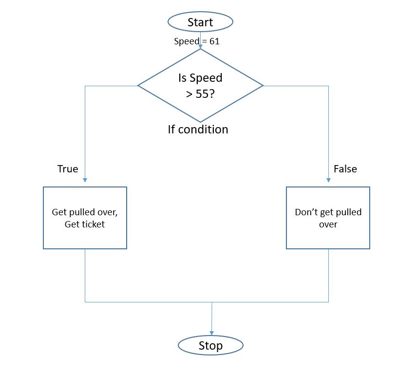
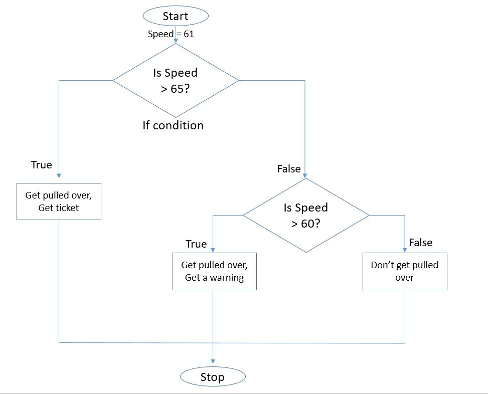
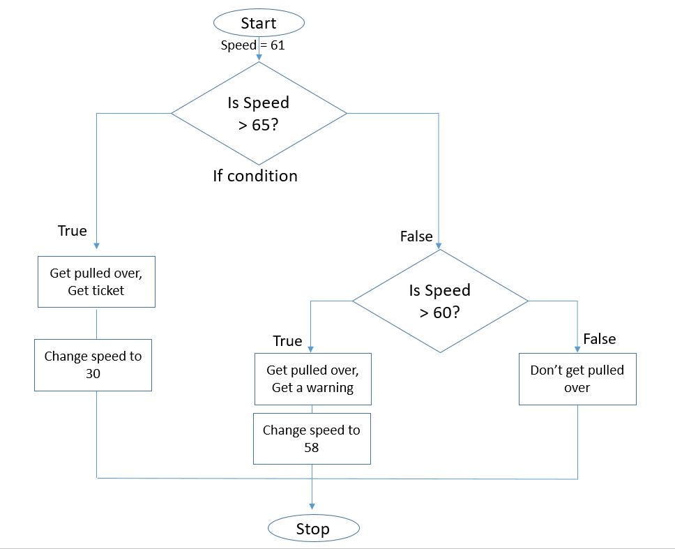
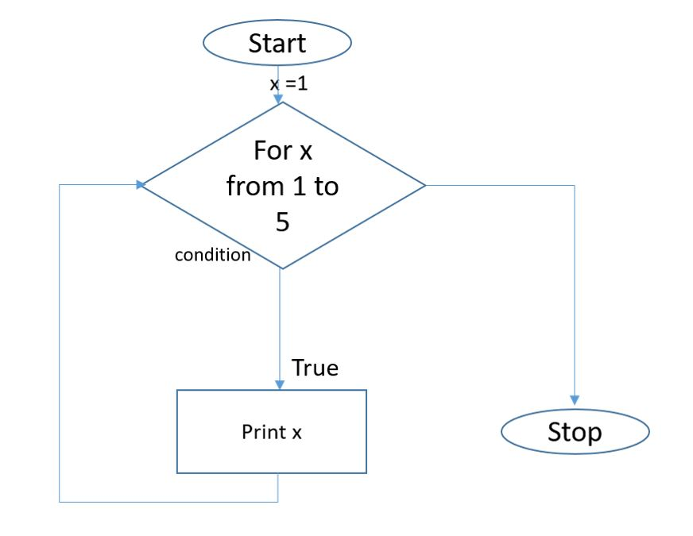
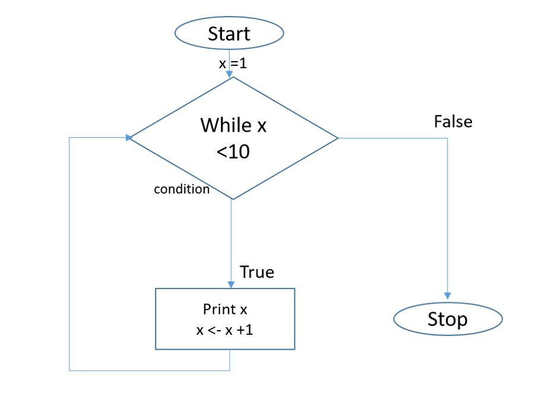

<style type="text/css">
  body{
  font-size: 14pt;
}
</style>

```{r setup, include=FALSE}
knitr::opts_chunk$set(echo = TRUE)
```

```{r message=FALSE}
library(stringr)

```
# Flow Control Basics: if statements, for loops, and while loops

### if, if else, and else

The general form for an if statement, an if with an else statement, and an if statement with multiple elses is as follows:

1. Option 1: if only

if(condition is true){  
  *execute this code*  
}

2. Option 2: if and one else

if(condition is true){  
  *execute this code*  
}else{  
  *execute this code if not true*  
}

3. Option 3: if and multiple else

if(condition is true){  
  *execute this code*  
}else if(secondary condition is true){    
  *execute this code*  
}else{      
  *execute if neither conditions are true*  
}


If we wanted to apply a certain section of code if a certain criteria is met, then an if statement is appropriate.  

Let's show a flow chart of a simple example then how we would code it.


if statement: 

Now let's code this up
```{r}

```


if else statement: 
```{r}

```

if else statement: 
```{r}
  
```


### For loops

For loops are meant to repeat any given process a certain number of time.
The "certain number of times" could be a number (10 times), it could be across every row of a data set, if could be based on every letter in a string

The general for loop construct is as follow:

for (counting mechanism){  
  *Execute this code each time*  
}

Here is a basic for loop flow chart.

for loop: 

Let's code this simple example.
```{r}


```

That was a very simple example.  Let's try to print off each vehicle name, and it's associated MPG from mtcars using a for loop.
```{r}

```

### while loops

While loops are very similar to for loops in construction, and serve similar purposes, except for loops execute code an exact number of times and while loops execute code while a condition is true.  

We could use a counting variable that counts up until it hits a certain number, or we could keep running code until a certain condition is met and we want to exit the while loop.

After each for loop, the counting variable iterates itself up; this does not automatically happen in while loops.

The general while loop construct is as follow:

while (condition is true){  
  *execute this code each time*  
}

while loop: 

Let's code up this simple example
```{r}


```

This example above is similar to our simple for loop example with two notable exceptions:  

* we are not doing the loop a set number of times  
* the while loop does not automatically change the counting variable

Let's look at a slightly more involved while loop that involves checking an actual condition.


```{r}


```
